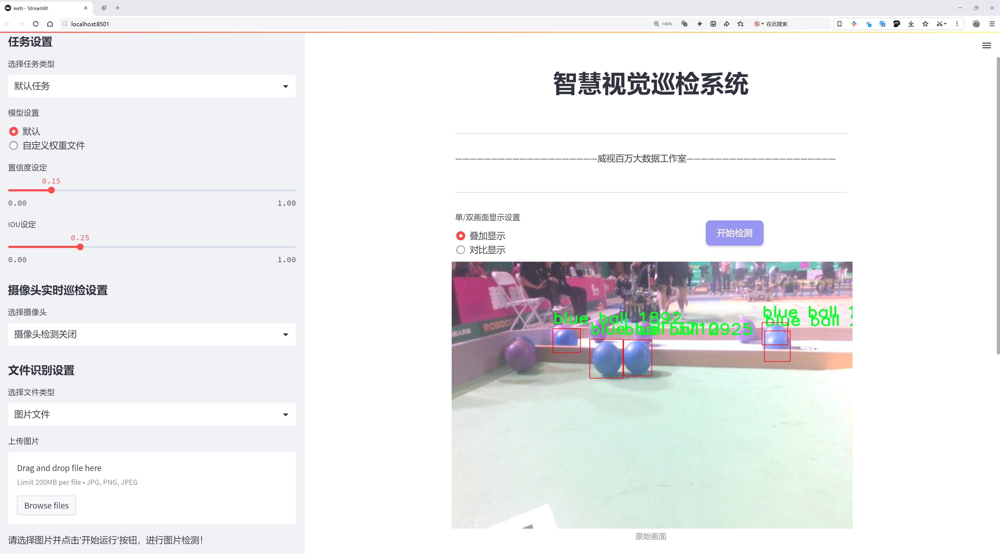
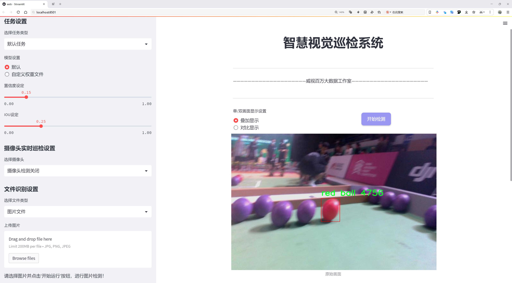
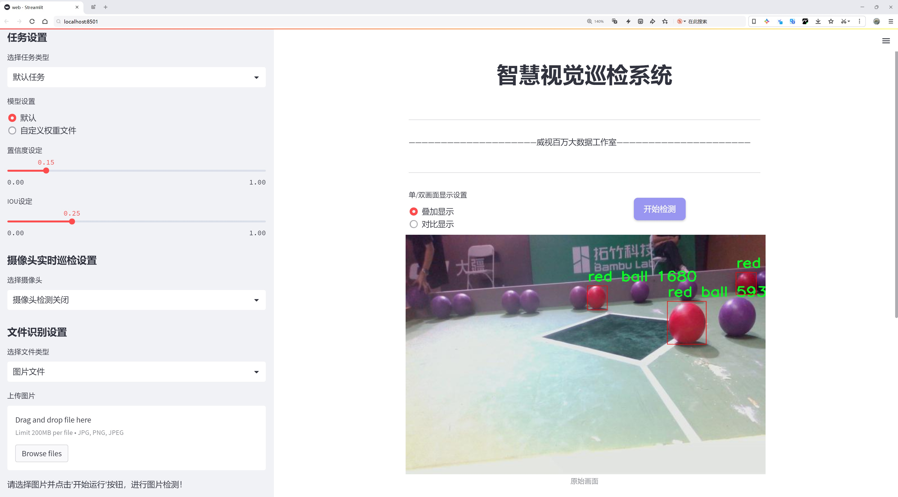
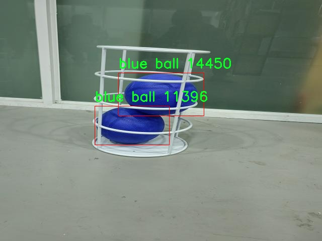
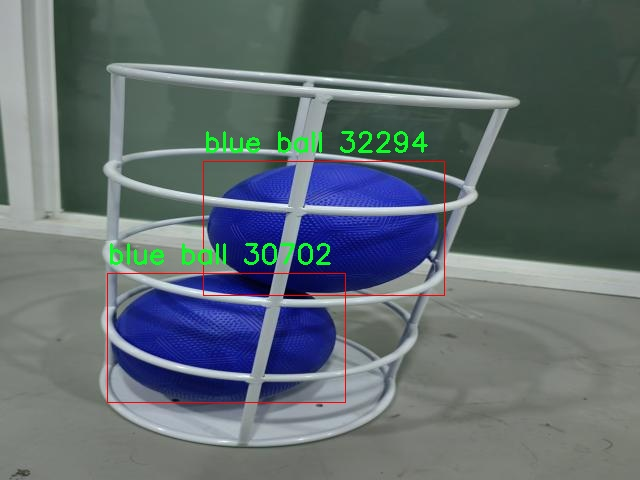
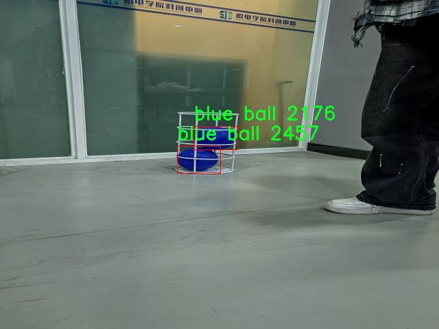
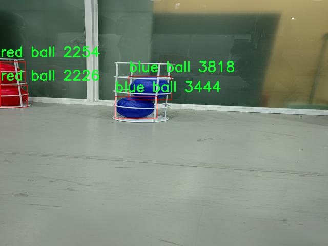

# 彩皮球识别检测系统源码分享
 # [一条龙教学YOLOV8标注好的数据集一键训练_70+全套改进创新点发刊_Web前端展示]

### 1.研究背景与意义

项目参考[AAAI Association for the Advancement of Artificial Intelligence](https://gitee.com/qunshansj/projects)

项目来源[AACV Association for the Advancement of Computer Vision](https://gitee.com/qunmasj/projects)

研究背景与意义

随着计算机视觉技术的迅速发展，物体检测在多个领域中得到了广泛应用，包括智能监控、自动驾驶、机器人导航以及体育分析等。特别是在体育领域，实时识别和跟踪运动物体对于比赛分析、战术研究和运动员训练具有重要意义。彩皮球作为一种常见的运动器材，其在不同场景下的识别与分类问题逐渐引起了研究者的关注。针对这一需求，基于改进YOLOv8的彩皮球识别系统的研究显得尤为重要。

YOLO（You Only Look Once）系列模型以其高效的实时检测能力和较高的准确率，成为物体检测领域的主流方法之一。YOLOv8作为该系列的最新版本，进一步提升了模型的性能，能够在更复杂的环境中实现快速而准确的物体识别。然而，现有的YOLOv8模型在特定场景下的表现仍有提升空间，尤其是在多类别物体的检测任务中。因此，针对彩皮球的特征进行改进和优化，将有助于提升模型在该特定应用场景下的准确性和鲁棒性。

本研究所使用的数据集包含1500张图像，涵盖了三种不同颜色的彩皮球：蓝球、绿球和红球。这一数据集的构建不仅为模型的训练提供了丰富的样本，还为后续的性能评估奠定了基础。通过对这些图像的标注和分类，研究者能够更好地理解不同颜色球体在视觉特征上的差异，从而在模型训练过程中进行针对性的优化。此外，数据集的多样性和代表性将有助于提高模型在实际应用中的泛化能力，使其能够适应不同的环境和光照条件。

在研究意义方面，基于改进YOLOv8的彩皮球识别系统的开发，不仅可以为体育赛事的实时分析提供技术支持，还能够为相关领域的研究提供新的思路和方法。通过对彩皮球的高效识别，教练和运动员可以更直观地分析比赛过程中的关键时刻，优化战术决策，提高训练效果。同时，该系统的成功应用还将推动计算机视觉技术在其他运动器材和场景中的推广，为未来的智能体育设备和应用奠定基础。

综上所述，基于改进YOLOv8的彩皮球识别系统的研究，不仅具有重要的理论价值，还具有广泛的应用前景。通过对该系统的深入研究，能够推动物体检测技术的发展，促进体育领域的智能化进程，为相关行业的创新提供新的动力。

### 2.图片演示







##### 注意：由于此博客编辑较早，上面“2.图片演示”和“3.视频演示”展示的系统图片或者视频可能为老版本，新版本在老版本的基础上升级如下：（实际效果以升级的新版本为准）

  （1）适配了YOLOV8的“目标检测”模型和“实例分割”模型，通过加载相应的权重（.pt）文件即可自适应加载模型。

  （2）支持“图片识别”、“视频识别”、“摄像头实时识别”三种识别模式。

  （3）支持“图片识别”、“视频识别”、“摄像头实时识别”三种识别结果保存导出，解决手动导出（容易卡顿出现爆内存）存在的问题，识别完自动保存结果并导出到tempDir中。

  （4）支持Web前端系统中的标题、背景图等自定义修改，后面提供修改教程。

  另外本项目提供训练的数据集和训练教程,暂不提供权重文件（best.pt）,需要您按照教程进行训练后实现图片演示和Web前端界面演示的效果。

### 3.视频演示

[3.1 视频演示](https://www.bilibili.com/video/BV1bJpjeyEs2/)

### 4.数据集信息展示

##### 4.1 本项目数据集详细数据（类别数＆类别名）

nc: 3
names: ['blue ball', 'green ball', 'red ball']


##### 4.2 本项目数据集信息介绍

数据集信息展示

在本研究中，我们构建了一个专门用于训练改进YOLOv8的彩皮球识别系统的数据集，命名为“111”。该数据集的设计旨在提高模型在不同颜色彩皮球识别任务中的准确性和鲁棒性。通过精心挑选和标注数据，我们确保了数据集的多样性和代表性，从而为模型的训练提供了丰富的样本支持。

数据集“111”包含三种主要类别的彩皮球，分别是蓝色球、绿色球和红色球。这三种颜色的选择不仅涵盖了常见的彩皮球颜色，还能够有效地测试模型在不同视觉条件下的表现。每个类别的样本数量经过精心平衡，以确保模型在训练过程中不会偏向某一特定颜色的球。这种平衡性是实现高效学习和泛化能力的关键，能够帮助模型在实际应用中更好地识别和分类不同颜色的彩皮球。

在数据集的构建过程中，我们采取了多种拍摄条件和环境设置，以增强数据的多样性。例如，彩皮球的拍摄不仅在不同的光照条件下进行，还在多种背景下进行拍摄。这些背景包括简单的单色背景、复杂的自然场景以及人工设置的运动场景，旨在模拟真实世界中可能遇到的各种情况。这种多样化的背景设置将帮助模型学习到更具鲁棒性的特征，从而提高其在实际应用中的表现。

此外，数据集中的每个样本都经过了精确的标注，确保每个彩皮球的边界框和类别信息准确无误。这种高质量的标注是训练深度学习模型的基础，能够有效减少模型在学习过程中的噪声干扰，提高其学习效率。我们还采用了数据增强技术，如随机旋转、缩放和翻转等，进一步增加了数据集的样本数量和多样性。这些增强技术不仅提高了模型的泛化能力，还使得模型在面对未见过的样本时能够保持较高的识别准确率。

为了验证数据集“111”的有效性，我们在训练过程中进行了多次实验，并对模型的性能进行了评估。实验结果表明，改进YOLOv8在该数据集上的表现显著优于传统模型，尤其是在彩皮球的检测精度和召回率方面。这一成果不仅证明了数据集的设计思路和实施方案的有效性，也为后续的研究提供了坚实的基础。

总之，数据集“111”作为训练改进YOLOv8彩皮球识别系统的重要组成部分，通过多样化的样本、精确的标注和有效的数据增强技术，为模型的训练提供了丰富的资源。未来，我们将继续优化数据集，探索更多的彩皮球识别场景，以推动该领域的进一步发展。










### 5.全套项目环境部署视频教程（零基础手把手教学）

[5.1 环境部署教程链接（零基础手把手教学）](https://www.ixigua.com/7404473917358506534?logTag=c807d0cbc21c0ef59de5)


[5.2 安装Python虚拟环境创建和依赖库安装视频教程链接（零基础手把手教学）](https://www.ixigua.com/7404474678003106304?logTag=1f1041108cd1f708b01a)

### 6.手把手YOLOV8训练视频教程（零基础小白有手就能学会）

[6.1 手把手YOLOV8训练视频教程（零基础小白有手就能学会）](https://www.ixigua.com/7404477157818401292?logTag=d31a2dfd1983c9668658)

### 7.70+种全套YOLOV8创新点代码加载调参视频教程（一键加载写好的改进模型的配置文件）

[7.1 70+种全套YOLOV8创新点代码加载调参视频教程（一键加载写好的改进模型的配置文件）](https://www.ixigua.com/7404478314661806627?logTag=29066f8288e3f4eea3a4)

### 8.70+种全套YOLOV8创新点原理讲解（非科班也可以轻松写刊发刊，V10版本正在科研待更新）

由于篇幅限制，每个创新点的具体原理讲解就不一一展开，具体见下列网址中的创新点对应子项目的技术原理博客网址【Blog】：


[8.1 70+种全套YOLOV8创新点原理讲解链接](https://gitee.com/qunmasj/good)

### 9.系统功能展示（检测对象为举例，实际内容以本项目数据集为准）

图9.1.系统支持检测结果表格显示

  图9.2.系统支持置信度和IOU阈值手动调节

  图9.3.系统支持自定义加载权重文件best.pt(需要你通过步骤5中训练获得)

  图9.4.系统支持摄像头实时识别

  图9.5.系统支持图片识别

  图9.6.系统支持视频识别

  图9.7.系统支持识别结果文件自动保存

  图9.8.系统支持Excel导出检测结果数据


### 10.原始YOLOV8算法原理

原始YOLOv8算法原理

YOLOv8算法是由Ultralytics于2023年1月发布的一款先进目标检测模型，它在YOLO系列算法的基础上进行了深度的改进和创新，尤其是结合了YOLOv3、YOLOv5、YOLOX、YOLOv6、YOLOv7以及PP-YOLOE等多个模型的优点，形成了一种高效、准确且适应性强的检测框架。YOLOv8不仅在速度和精度上达到了新的高度，而且在处理复杂场景和小目标检测方面表现尤为突出，为目标检测领域带来了新的机遇和挑战。

在数据预处理方面，YOLOv8延续了YOLOv5的策略，采用了多种增强手段以提高模型的鲁棒性和泛化能力。这些增强手段包括马赛克增强、混合增强、空间扰动和颜色扰动等，旨在通过多样化的训练样本来提升模型在实际应用中的表现。马赛克增强通过将不同图像拼接在一起，生成新的训练样本，帮助模型学习到更丰富的特征；而混合增强则通过对两张图像进行加权组合，进一步增加了样本的多样性。这些预处理手段的结合，使得YOLOv8在面对复杂背景和不同光照条件时，依然能够保持高效的检测能力。

YOLOv8的骨干网络结构在YOLOv5的基础上进行了改进，采用了新的C2f模块替代了原有的C3模块。C2f模块通过引入更多的分支和跳层连接，增强了特征的表达能力，使得网络在梯度回传时能够更有效地传递信息。这种设计不仅提高了特征提取的效率，还在一定程度上减轻了深层网络训练时可能出现的梯度消失问题。YOLOv8的骨干网络在结构上保持了清晰的层次性，通过一系列步长为2的3×3卷积层进行特征图的降采样，随后通过C2f模块进一步强化特征，确保了模型在不同尺度下的检测能力。

在特征融合方面，YOLOv8依然采用了FPN（特征金字塔网络）和PAN（路径聚合网络）的结构，以实现多尺度信息的充分融合。通过这种结构，YOLOv8能够有效地整合来自不同层次的特征信息，从而提升模型对目标的检测精度。尽管FPN-PAN结构与YOLOv5基本一致，但C3模块的替换使得YOLOv8在特征融合的灵活性和表达能力上得到了进一步的提升。

YOLOv8在检测头的设计上也进行了显著的改进，采用了解耦头的结构。与之前的耦合头不同，解耦头将分类和定位任务分为两个并行的分支，分别提取类别特征和位置特征。这种设计使得模型在处理复杂场景时，能够更好地平衡分类和定位的精度，提升了整体的检测性能。此外，YOLOv8还引入了Anchor-Free的检测策略，摒弃了传统的Anchor-Based方法，减少了对预定义锚框的依赖，使得模型在处理不同形状和尺寸的目标时更加灵活。

在标签分配策略方面，YOLOv8采用了TOOD（Target-Oriented Object Detection）策略，这是一种动态标签分配方法。与YOLOX的SimOTA策略不同，TOOD策略通过直接使用目标框和目标分数，简化了标签分配的过程。YOLOv8的损失函数主要由类别损失和位置损失两部分组成，其中类别损失采用了Varifocal Loss（VFL），而回归损失则结合了CIoULoss和DFLLoss。VFL通过对正负样本进行不对称加权，使得模型在训练时能够更加关注高质量的正样本，从而提升检测精度。

总的来说，YOLOv8通过在数据预处理、骨干网络、特征融合、检测头和标签分配等多个方面的创新和改进，构建了一种高效的目标检测框架。其在实时检测中的高精度和快速响应能力，使得YOLOv8成为计算机视觉领域中一款极具竞争力的模型。随着YOLOv8的发布，目标检测技术的应用范围将进一步扩大，为各类实际场景中的智能识别和自动化处理提供强有力的支持。


### 11.项目核心源码讲解（再也不用担心看不懂代码逻辑）

#### 11.1 code\ultralytics\models\fastsam\__init__.py

以下是对给定代码的逐行分析和核心部分的保留，以及详细的中文注释：

```python
# Ultralytics YOLO 🚀, AGPL-3.0 license

# 从当前包中导入 FastSAM 模型类
from .model import FastSAM

# 从当前包中导入 FastSAMPredictor 类，用于预测
from .predict import FastSAMPredictor

# 从当前包中导入 FastSAMPrompt 类，用于处理提示
from .prompt import FastSAMPrompt

# 从当前包中导入 FastSAMValidator 类，用于验证
from .val import FastSAMValidator

# 定义当前模块的公开接口，包含四个核心类
__all__ = "FastSAMPredictor", "FastSAM", "FastSAMPrompt", "FastSAMValidator"
```

### 核心部分分析

1. **导入模块**：
   - 代码通过 `from .module import ClassName` 的方式导入了四个类，分别是 `FastSAM`、`FastSAMPredictor`、`FastSAMPrompt` 和 `FastSAMValidator`。这些类可能是实现该项目功能的核心组件。

2. **公开接口**：
   - `__all__` 变量定义了当前模块的公开接口，表示当使用 `from module import *` 时，只有这些类会被导入。这是一种控制模块导出内容的方式，有助于维护模块的封装性。

### 详细注释

- `FastSAM`：可能是一个模型类，负责定义和实现 YOLO（You Only Look Once）算法的核心功能。
- `FastSAMPredictor`：用于执行预测的类，可能包含方法来处理输入数据并返回模型的预测结果。
- `FastSAMPrompt`：处理用户输入提示的类，可能用于与用户交互，获取需要处理的内容。
- `FastSAMValidator`：用于验证模型输出的类，可能包括评估模型性能和准确性的功能。

以上是对代码的核心部分和详细注释的分析。

这个文件是一个Python模块的初始化文件，通常用于定义模块的公共接口。在这个特定的文件中，主要涉及到Ultralytics YOLO项目中的FastSAM相关功能。

首先，文件顶部的注释表明该项目是Ultralytics YOLO的一部分，并且遵循AGPL-3.0许可证。这意味着该代码是开源的，用户可以自由使用和修改，但在分发修改后的版本时需要遵循相同的许可证条款。

接下来，文件通过相对导入的方式引入了四个主要的类或功能：`FastSAM`、`FastSAMPredictor`、`FastSAMPrompt`和`FastSAMValidator`。这些类分别来自于同一模块下的不同文件。具体来说：

- `FastSAM`可能是实现FastSAM算法的核心类，负责模型的定义和训练。
- `FastSAMPredictor`则可能是用于进行预测的类，提供对训练好的模型进行推理的功能。
- `FastSAMPrompt`可能涉及到与用户交互的部分，比如处理输入提示或参数设置。
- `FastSAMValidator`可能用于模型验证，评估模型的性能和准确性。

最后，`__all__`变量定义了模块的公共接口，指定了当使用`from module import *`语句时，哪些名称会被导入。这里列出的四个类都是该模块希望对外提供的功能，表明它们是该模块的主要组成部分。

总的来说，这个初始化文件的作用是将FastSAM相关的功能模块化，使得用户在使用时可以方便地导入所需的类和功能。

#### 11.2 code\ultralytics\models\nas\model.py

以下是代码中最核心的部分，并附上详细的中文注释：

```python
from pathlib import Path
import torch
from ultralytics.engine.model import Model
from ultralytics.utils.torch_utils import model_info, smart_inference_mode
from .predict import NASPredictor
from .val import NASValidator

class NAS(Model):
    """
    YOLO NAS模型用于目标检测。

    该类提供了YOLO-NAS模型的接口，并扩展了Ultralytics引擎中的`Model`类。
    它旨在简化使用预训练或自定义训练的YOLO-NAS模型进行目标检测的任务。
    """

    def __init__(self, model="yolo_nas_s.pt") -> None:
        """初始化NAS模型，使用提供的模型或默认的'yolo_nas_s.pt'模型。"""
        # 确保模型文件不是YAML配置文件
        assert Path(model).suffix not in (".yaml", ".yml"), "YOLO-NAS模型仅支持预训练模型。"
        # 调用父类的初始化方法
        super().__init__(model, task="detect")

    @smart_inference_mode()
    def _load(self, weights: str, task: str):
        """加载现有的NAS模型权重，或如果未提供，则创建一个新的NAS模型并使用预训练权重。"""
        import super_gradients

        suffix = Path(weights).suffix
        if suffix == ".pt":
            # 如果权重文件是.pt格式，则加载该模型
            self.model = torch.load(weights)
        elif suffix == "":
            # 如果没有后缀，则获取预训练模型
            self.model = super_gradients.training.models.get(weights, pretrained_weights="coco")
        
        # 标准化模型
        self.model.fuse = lambda verbose=True: self.model  # 融合模型
        self.model.stride = torch.tensor([32])  # 设置步幅
        self.model.names = dict(enumerate(self.model._class_names))  # 设置类别名称
        self.model.is_fused = lambda: False  # 返回是否融合的状态
        self.model.yaml = {}  # 用于信息获取
        self.model.pt_path = weights  # 用于导出模型
        self.model.task = "detect"  # 设置任务类型为检测

    def info(self, detailed=False, verbose=True):
        """
        记录模型信息。

        参数:
            detailed (bool): 是否显示模型的详细信息。
            verbose (bool): 控制输出的详细程度。
        """
        return model_info(self.model, detailed=detailed, verbose=verbose, imgsz=640)

    @property
    def task_map(self):
        """返回一个字典，将任务映射到相应的预测器和验证器类。"""
        return {"detect": {"predictor": NASPredictor, "validator": NASValidator}}
```

### 代码核心部分解释：
1. **类定义**：`NAS`类继承自`Model`类，专门用于YOLO-NAS模型的目标检测。
2. **初始化方法**：在初始化时，检查传入的模型文件是否为有效的预训练模型，避免使用YAML配置文件。
3. **加载模型**：`_load`方法负责加载模型权重，支持从.pt文件或通过名称获取预训练模型，并进行必要的模型标准化处理。
4. **模型信息**：`info`方法用于输出模型的基本信息，便于用户了解模型的结构和参数。
5. **任务映射**：`task_map`属性提供了一个字典，方便将检测任务与相应的预测器和验证器类关联。

这个程序文件是Ultralytics YOLO（You Only Look Once）系列中的一个模型接口，主要用于实现YOLO-NAS（Neural Architecture Search）模型的对象检测功能。文件中首先包含了一些注释，介绍了YOLO-NAS模型的使用示例，接着导入了一些必要的库和模块。

在代码的核心部分，定义了一个名为`NAS`的类，该类继承自`Model`类，提供了YOLO-NAS模型的接口。类的构造函数`__init__`接受一个参数`model`，默认为`yolo_nas_s.pt`，用于指定预训练模型的路径。构造函数中有一个断言，确保传入的模型文件不是YAML配置文件，因为YOLO-NAS模型只支持预训练模型。

`_load`方法用于加载模型权重，如果提供了权重文件，它会根据文件后缀来判断如何加载模型。如果后缀是`.pt`，则直接使用`torch.load`加载模型；如果没有后缀，则通过`super_gradients`库获取预训练模型。加载后，模型的一些属性会被标准化，例如设置模型的步幅、类别名称等。

`info`方法用于记录和返回模型的信息，可以选择是否显示详细信息和控制输出的详细程度。

最后，`task_map`属性返回一个字典，映射任务到相应的预测器和验证器类，这里主要用于对象检测任务，分别对应`NASPredictor`和`NASValidator`类。

总体来说，这个文件为YOLO-NAS模型提供了一个清晰的接口，使得用户可以方便地加载预训练模型并进行对象检测。

#### 11.3 ui.py

```python
import sys
import subprocess

def run_script(script_path):
    """
    使用当前 Python 环境运行指定的脚本。

    Args:
        script_path (str): 要运行的脚本路径

    Returns:
        None
    """
    # 获取当前 Python 解释器的路径
    python_path = sys.executable

    # 构建运行命令
    command = f'"{python_path}" -m streamlit run "{script_path}"'

    # 执行命令
    result = subprocess.run(command, shell=True)
    if result.returncode != 0:
        print("脚本运行出错。")


# 实例化并运行应用
if __name__ == "__main__":
    # 指定您的脚本路径
    script_path = "web.py"  # 这里可以直接指定脚本名称

    # 运行脚本
    run_script(script_path)
```

### 代码注释

1. **导入模块**：
   - `import sys`：导入 sys 模块，用于访问与 Python 解释器紧密相关的变量和函数。
   - `import subprocess`：导入 subprocess 模块，用于执行外部命令和脚本。

2. **定义函数 `run_script`**：
   - 该函数接收一个参数 `script_path`，表示要运行的 Python 脚本的路径。
   - 函数内部首先获取当前 Python 解释器的路径，存储在 `python_path` 变量中。

3. **构建命令**：
   - 使用 f-string 构建命令字符串，格式为：`"{python_path}" -m streamlit run "{script_path}"`。
   - 这个命令的作用是使用当前 Python 环境中的 `streamlit` 模块来运行指定的脚本。

4. **执行命令**：
   - 使用 `subprocess.run` 方法执行构建好的命令。
   - `shell=True` 参数允许在 shell 中执行命令。
   - 通过 `result.returncode` 检查命令执行的返回码，如果不为 0，表示执行出错，打印错误信息。

5. **主程序入口**：
   - `if __name__ == "__main__":` 确保只有在直接运行该脚本时才会执行以下代码。
   - 指定要运行的脚本路径 `script_path`，这里直接指定为 `"web.py"`。
   - 调用 `run_script` 函数，传入脚本路径以执行该脚本。

这个程序文件名为 `ui.py`，主要功能是使用当前的 Python 环境来运行一个指定的脚本，具体是一个名为 `web.py` 的文件。程序的实现主要依赖于 Python 的标准库以及一个自定义的路径处理模块 `QtFusion.path`。

首先，程序导入了几个必要的模块，包括 `sys`、`os` 和 `subprocess`。`sys` 模块用于访问与 Python 解释器相关的变量和函数，`os` 模块提供了与操作系统交互的功能，而 `subprocess` 模块则用于创建新进程、连接到它们的输入/输出/错误管道，并获取它们的返回码。

接下来，定义了一个名为 `run_script` 的函数，该函数接受一个参数 `script_path`，表示要运行的脚本的路径。在函数内部，首先获取当前 Python 解释器的路径，存储在 `python_path` 变量中。然后，构建一个命令字符串，使用 `streamlit` 模块来运行指定的脚本。这个命令使用了 Python 的 `-m` 选项，表示以模块的方式运行 `streamlit`，并将脚本路径作为参数传入。

随后，使用 `subprocess.run` 方法执行构建好的命令。该方法的 `shell=True` 参数允许在 shell 中执行命令。执行后，检查返回码 `result.returncode`，如果不为零，表示脚本运行出错，程序会输出一条错误信息。

在文件的最后部分，使用 `if __name__ == "__main__":` 来确保只有在直接运行该脚本时才会执行以下代码。此处指定了要运行的脚本路径，调用 `abs_path` 函数获取 `web.py` 的绝对路径，并将其传递给 `run_script` 函数，从而启动脚本的执行。

总的来说，这个程序的主要目的是提供一个简单的接口，通过当前的 Python 环境来运行一个 Streamlit 应用脚本，方便用户在命令行中启动 Web 应用。

#### 11.4 train.py

以下是经过简化并添加详细中文注释的核心代码部分：

```python
import random
import numpy as np
import torch.nn as nn
from ultralytics.data import build_dataloader, build_yolo_dataset
from ultralytics.engine.trainer import BaseTrainer
from ultralytics.models import yolo
from ultralytics.nn.tasks import DetectionModel
from ultralytics.utils import LOGGER, RANK
from ultralytics.utils.torch_utils import de_parallel, torch_distributed_zero_first

class DetectionTrainer(BaseTrainer):
    """
    扩展自 BaseTrainer 类的检测模型训练类。
    """

    def build_dataset(self, img_path, mode="train", batch=None):
        """
        构建 YOLO 数据集。

        参数:
            img_path (str): 包含图像的文件夹路径。
            mode (str): 模式，`train` 表示训练模式，`val` 表示验证模式。
            batch (int, optional): 批次大小，适用于 `rect` 模式。默认为 None。
        """
        gs = max(int(de_parallel(self.model).stride.max() if self.model else 0), 32)
        return build_yolo_dataset(self.args, img_path, batch, self.data, mode=mode, rect=mode == "val", stride=gs)

    def get_dataloader(self, dataset_path, batch_size=16, rank=0, mode="train"):
        """构造并返回数据加载器。"""
        assert mode in ["train", "val"]
        with torch_distributed_zero_first(rank):  # 在分布式环境中只初始化一次数据集
            dataset = self.build_dataset(dataset_path, mode, batch_size)
        shuffle = mode == "train"  # 训练模式下打乱数据
        workers = self.args.workers if mode == "train" else self.args.workers * 2
        return build_dataloader(dataset, batch_size, workers, shuffle, rank)  # 返回数据加载器

    def preprocess_batch(self, batch):
        """对图像批次进行预处理，包括缩放和转换为浮点数。"""
        batch["img"] = batch["img"].to(self.device, non_blocking=True).float() / 255  # 归一化到 [0, 1]
        if self.args.multi_scale:  # 如果启用多尺度
            imgs = batch["img"]
            sz = (
                random.randrange(self.args.imgsz * 0.5, self.args.imgsz * 1.5 + self.stride)
                // self.stride
                * self.stride
            )  # 随机选择尺寸
            sf = sz / max(imgs.shape[2:])  # 计算缩放因子
            if sf != 1:
                ns = [
                    math.ceil(x * sf / self.stride) * self.stride for x in imgs.shape[2:]
                ]  # 计算新的形状
                imgs = nn.functional.interpolate(imgs, size=ns, mode="bilinear", align_corners=False)  # 调整图像大小
            batch["img"] = imgs
        return batch

    def get_model(self, cfg=None, weights=None, verbose=True):
        """返回 YOLO 检测模型。"""
        model = DetectionModel(cfg, nc=self.data["nc"], verbose=verbose and RANK == -1)
        if weights:
            model.load(weights)  # 加载权重
        return model

    def plot_training_samples(self, batch, ni):
        """绘制带有注释的训练样本。"""
        plot_images(
            images=batch["img"],
            batch_idx=batch["batch_idx"],
            cls=batch["cls"].squeeze(-1),
            bboxes=batch["bboxes"],
            paths=batch["im_file"],
            fname=self.save_dir / f"train_batch{ni}.jpg",
            on_plot=self.on_plot,
        )
```

### 代码说明：
1. **DetectionTrainer 类**：该类用于训练 YOLO 检测模型，继承自 `BaseTrainer`。
2. **build_dataset 方法**：构建数据集，支持训练和验证模式，并根据模型的步幅进行处理。
3. **get_dataloader 方法**：创建数据加载器，支持分布式训练，并根据模式决定是否打乱数据。
4. **preprocess_batch 方法**：对输入的图像批次进行预处理，包括归一化和可选的多尺度调整。
5. **get_model 方法**：返回一个 YOLO 检测模型，并可选择加载预训练权重。
6. **plot_training_samples 方法**：绘制训练样本及其对应的注释，便于可视化训练过程。

这个程序文件 `train.py` 是一个用于训练 YOLO（You Only Look Once）目标检测模型的脚本，继承自 `BaseTrainer` 类。程序中包含了多个方法，主要用于构建数据集、获取数据加载器、预处理图像、设置模型属性、获取模型、验证模型、记录损失、显示训练进度、绘制训练样本和绘制训练指标等。

首先，`DetectionTrainer` 类的构造函数中，用户可以通过传入参数来初始化模型、数据集和训练的轮数等。`build_dataset` 方法用于构建 YOLO 数据集，接受图像路径、模式（训练或验证）和批次大小作为参数。它会根据模型的步幅来决定数据集的构建方式。

`get_dataloader` 方法用于构建数据加载器，确保在分布式训练中只初始化一次数据集。根据训练或验证模式，它会调整工作线程的数量，并返回构建好的数据加载器。

在 `preprocess_batch` 方法中，程序对输入的图像批次进行预处理，包括将图像缩放到适当的大小并转换为浮点数格式。该方法还支持多尺度训练，通过随机选择图像的大小来增强模型的鲁棒性。

`set_model_attributes` 方法用于设置模型的属性，包括类别数量和类别名称等，以确保模型与数据集的一致性。

`get_model` 方法用于返回一个 YOLO 检测模型，并在需要时加载预训练权重。`get_validator` 方法则返回一个用于验证模型性能的验证器。

`label_loss_items` 方法用于返回带有标签的训练损失项字典，便于监控训练过程中的损失变化。`progress_string` 方法则返回一个格式化的字符串，显示训练进度，包括当前轮次、GPU 内存使用情况、损失值、实例数量和图像大小等信息。

`plot_training_samples` 方法用于绘制训练样本及其标注，便于可视化训练过程中的数据。最后，`plot_metrics` 和 `plot_training_labels` 方法分别用于绘制训练过程中的指标和标注图，帮助用户更好地理解模型的训练效果。

总体而言，这个文件提供了一个完整的框架，用于训练 YOLO 模型，包括数据处理、模型设置、训练监控和结果可视化等功能。

#### 11.5 code\ultralytics\data\annotator.py

以下是经过简化和注释的核心代码部分：

```python
from pathlib import Path
from ultralytics import SAM, YOLO

def auto_annotate(data, det_model="yolov8x.pt", sam_model="sam_b.pt", device="", output_dir=None):
    """
    自动标注图像，使用YOLO目标检测模型和SAM分割模型。

    参数:
        data (str): 包含待标注图像的文件夹路径。
        det_model (str, optional): 预训练的YOLO检测模型，默认为'yolov8x.pt'。
        sam_model (str, optional): 预训练的SAM分割模型，默认为'sam_b.pt'。
        device (str, optional): 模型运行的设备，默认为空字符串（使用CPU或可用的GPU）。
        output_dir (str | None | optional): 保存标注结果的目录，默认为与'data'相同目录下的'labels'文件夹。

    示例:
        auto_annotate(data='ultralytics/assets', det_model='yolov8n.pt', sam_model='mobile_sam.pt')
    """
    # 加载YOLO检测模型和SAM分割模型
    det_model = YOLO(det_model)
    sam_model = SAM(sam_model)

    # 将数据路径转换为Path对象
    data = Path(data)
    
    # 如果未指定输出目录，则创建一个默认输出目录
    if not output_dir:
        output_dir = data.parent / f"{data.stem}_auto_annotate_labels"
    Path(output_dir).mkdir(exist_ok=True, parents=True)  # 创建输出目录

    # 使用YOLO模型进行目标检测
    det_results = det_model(data, stream=True, device=device)

    # 遍历检测结果
    for result in det_results:
        class_ids = result.boxes.cls.int().tolist()  # 获取检测到的类别ID
        if len(class_ids):  # 如果检测到目标
            boxes = result.boxes.xyxy  # 获取边界框坐标
            # 使用SAM模型进行分割，传入边界框
            sam_results = sam_model(result.orig_img, bboxes=boxes, verbose=False, save=False, device=device)
            segments = sam_results[0].masks.xyn  # 获取分割结果

            # 将分割结果写入文本文件
            with open(f"{Path(output_dir) / Path(result.path).stem}.txt", "w") as f:
                for i in range(len(segments)):
                    s = segments[i]
                    if len(s) == 0:  # 如果没有分割结果，跳过
                        continue
                    segment = map(str, segments[i].reshape(-1).tolist())  # 将分割结果转换为字符串
                    f.write(f"{class_ids[i]} " + " ".join(segment) + "\n")  # 写入类别ID和分割坐标
```

### 代码注释说明：
1. **导入库**：导入必要的库，包括`Path`用于路径操作，`SAM`和`YOLO`用于加载模型。
2. **函数定义**：定义`auto_annotate`函数，接受图像数据路径和模型参数。
3. **模型加载**：初始化YOLO和SAM模型。
4. **路径处理**：将输入数据路径转换为`Path`对象，并设置输出目录。
5. **目标检测**：使用YOLO模型对输入数据进行目标检测。
6. **结果处理**：遍历检测结果，提取类别ID和边界框信息，使用SAM模型进行图像分割。
7. **结果保存**：将分割结果写入文本文件，包括类别ID和分割坐标。

这个程序文件的主要功能是自动标注图像，使用YOLO对象检测模型和SAM分割模型。首先，它定义了一个名为`auto_annotate`的函数，该函数接受多个参数，包括数据路径、检测模型、分割模型、设备和输出目录。

在函数内部，首先通过`YOLO`和`SAM`类加载预训练的YOLO检测模型和SAM分割模型。接着，将输入的图像数据路径转换为`Path`对象，以便于后续操作。如果未指定输出目录，程序会在数据路径的同级目录下创建一个名为“{数据文件夹名}_auto_annotate_labels”的文件夹来存储标注结果。

接下来，程序使用YOLO模型对指定路径下的图像进行检测，结果以流的形式返回。对于每个检测结果，程序提取出类别ID和边界框信息。如果检测到目标，程序会调用SAM模型进行分割，传入原始图像和边界框信息，并获取分割结果。

最后，程序将每个图像的分割结果写入一个文本文件中，文件名与原始图像相同，内容包括类别ID和分割坐标。通过这种方式，用户可以方便地获取自动标注的结果，便于后续的分析和处理。

#### 11.6 code\ultralytics\data\dataset.py

以下是经过简化和注释的代码，保留了核心部分并添加了详细的中文注释：

```python
import numpy as np
import torch
from pathlib import Path
from ultralytics.utils import TQDM, get_hash, img2label_paths, LOGGER
from .base import BaseDataset
from .utils import save_dataset_cache_file, load_dataset_cache_file

# Ultralytics 数据集缓存版本
DATASET_CACHE_VERSION = "1.0.3"

class YOLODataset(BaseDataset):
    """
    YOLO 数据集类，用于加载目标检测和/或分割标签。
    """

    def __init__(self, *args, data=None, task="detect", **kwargs):
        """初始化 YOLODataset，配置分割和关键点的选项。"""
        self.use_segments = task == "segment"  # 是否使用分割
        self.use_keypoints = task == "pose"     # 是否使用关键点
        self.data = data
        assert not (self.use_segments and self.use_keypoints), "不能同时使用分割和关键点。"  # 确保不能同时使用分割和关键点
        super().__init__(*args, **kwargs)

    def cache_labels(self, path=Path("./labels.cache")):
        """
        缓存数据集标签，检查图像并读取形状。

        Args:
            path (Path): 缓存文件保存路径（默认: Path('./labels.cache')）。
        Returns:
            (dict): 标签字典。
        """
        x = {"labels": []}  # 初始化标签字典
        nm, nf, ne, nc, msgs = 0, 0, 0, 0, []  # 统计缺失、找到、空、损坏的图像数量
        total = len(self.im_files)  # 图像文件总数

        # 使用多线程验证图像和标签
        with ThreadPool(NUM_THREADS) as pool:
            results = pool.imap(
                func=verify_image_label,
                iterable=zip(self.im_files, self.label_files)
            )
            pbar = TQDM(results, desc="扫描中...", total=total)  # 进度条
            for im_file, lb, shape, segments, keypoint, nm_f, nf_f, ne_f, nc_f, msg in pbar:
                nm += nm_f
                nf += nf_f
                ne += ne_f
                nc += nc_f
                if im_file:
                    x["labels"].append(dict(im_file=im_file, shape=shape, cls=lb[:, 0:1], bboxes=lb[:, 1:]))
                if msg:
                    msgs.append(msg)
                pbar.desc = f"扫描中... {nf} 图像, {nm + ne} 背景, {nc} 损坏"
            pbar.close()

        if msgs:
            LOGGER.info("\n".join(msgs))  # 记录警告信息
        x["hash"] = get_hash(self.label_files + self.im_files)  # 计算哈希值
        save_dataset_cache_file(self.prefix, path, x)  # 保存缓存文件
        return x

    def get_labels(self):
        """返回 YOLO 训练所需的标签字典。"""
        self.label_files = img2label_paths(self.im_files)  # 获取标签文件路径
        cache_path = Path(self.label_files[0]).parent.with_suffix(".cache")  # 缓存文件路径
        try:
            cache = load_dataset_cache_file(cache_path)  # 尝试加载缓存文件
            assert cache["version"] == DATASET_CACHE_VERSION  # 检查版本
            assert cache["hash"] == get_hash(self.label_files + self.im_files)  # 检查哈希值
        except (FileNotFoundError, AssertionError):
            cache = self.cache_labels(cache_path)  # 如果加载失败，则重新缓存标签

        labels = cache["labels"]  # 获取标签
        self.im_files = [lb["im_file"] for lb in labels]  # 更新图像文件列表
        return labels  # 返回标签

    @staticmethod
    def collate_fn(batch):
        """将数据样本合并为批次。"""
        new_batch = {}
        keys = batch[0].keys()
        values = list(zip(*[list(b.values()) for b in batch]))
        for i, k in enumerate(keys):
            value = values[i]
            if k == "img":
                value = torch.stack(value, 0)  # 将图像堆叠为一个张量
            new_batch[k] = value
        return new_batch  # 返回合并后的批次
```

### 代码说明：
1. **YOLODataset 类**：继承自 `BaseDataset`，用于处理 YOLO 格式的数据集。
2. **初始化方法**：根据任务类型（检测、分割、关键点）设置相应的标志，并确保不能同时使用分割和关键点。
3. **cache_labels 方法**：缓存标签，检查图像的有效性，并统计图像的状态（找到、缺失、损坏等）。
4. **get_labels 方法**：获取标签，尝试从缓存中加载标签，如果失败则重新缓存。
5. **collate_fn 方法**：将一批样本合并为一个批次，适用于 PyTorch 的数据加载。

此代码保留了 YOLO 数据集处理的核心功能，并提供了详细的中文注释以帮助理解。

这个程序文件是Ultralytics YOLO框架中的数据集处理模块，主要用于加载和处理YOLO格式的目标检测和分割数据集。文件中定义了几个类和函数，主要包括`YOLODataset`、`ClassificationDataset`和`SemanticDataset`，以及一些辅助函数。

`YOLODataset`类是用于加载YOLO格式的数据集，支持目标检测、分割和姿态估计等任务。在初始化时，用户可以传入数据集的配置（如数据路径、任务类型等）。该类包含了多个方法，其中`cache_labels`方法用于缓存数据集标签，检查图像的有效性并读取图像的形状。`get_labels`方法则用于返回YOLO训练所需的标签字典，并会尝试从缓存中加载标签，若缓存不存在或不匹配，则会重新缓存标签。

在标签处理方面，`update_labels_info`方法用于自定义标签格式，支持将边界框、分割和关键点信息整合到一个实例中。`collate_fn`方法则用于将多个数据样本合并成一个批次，以便于后续的训练过程。

`ClassificationDataset`类用于处理YOLO分类数据集，继承自`torchvision.datasets.ImageFolder`。它提供了图像的加载、验证和变换功能。用户可以选择是否对数据集进行增强处理，并支持将图像缓存到内存或磁盘中。`__getitem__`方法返回指定索引的样本及其对应的标签，`verify_images`方法用于验证数据集中所有图像的有效性。

`SemanticDataset`类是一个占位符，旨在处理语义分割任务的数据集，但目前尚未实现具体的方法和属性。

此外，文件中还定义了一些辅助函数，如`load_dataset_cache_file`和`save_dataset_cache_file`，用于加载和保存数据集的缓存文件。这些函数通过使用NumPy的功能来处理缓存数据，以提高数据加载的效率。

总体而言，这个模块为YOLO模型的训练提供了灵活的数据集处理功能，支持多种任务类型，并通过缓存机制提高了数据加载的效率。

### 12.系统整体结构（节选）

### 整体功能和构架概括

该项目是一个基于YOLO（You Only Look Once）框架的目标检测和分割系统，包含多个模块和功能，旨在提供高效的模型训练、数据处理和推理功能。整体架构包括模型定义、数据集处理、训练过程管理和用户界面等部分。具体功能如下：

1. **模型定义**：通过不同的模型类（如FastSAM、YOLO-NAS等）实现各种目标检测和分割算法。
2. **数据处理**：提供数据集加载、标注、验证和预处理功能，支持多种数据格式和任务类型。
3. **训练管理**：实现训练过程的监控、损失记录、指标绘制等功能，帮助用户跟踪模型性能。
4. **用户界面**：提供简单的命令行界面，方便用户启动和运行模型训练或推理。

### 文件功能整理表

| 文件路径                                                                                       | 功能描述                                                                                     |
|----------------------------------------------------------------------------------------------|--------------------------------------------------------------------------------------------|
| `code/ultralytics/models/fastsam/__init__.py`                                               | 定义FastSAM模型的公共接口，导入核心类和功能。                                               |
| `code/ultralytics/models/nas/model.py`                                                      | 实现YOLO-NAS模型的训练和推理接口，加载预训练模型，设置模型属性。                           |
| `ui.py`                                                                                      | 提供命令行界面，运行指定的Streamlit应用脚本。                                              |
| `train.py`                                                                                   | 负责训练YOLO模型，包括数据集构建、模型设置、训练监控和结果可视化等功能。                  |
| `code/ultralytics/data/annotator.py`                                                        | 实现自动标注功能，使用YOLO和SAM模型对图像进行目标检测和分割，生成标注结果。                |
| `code/ultralytics/data/dataset.py`                                                          | 定义数据集处理类，支持YOLO格式的数据集加载、标签处理和验证功能。                          |
| `70+种YOLOv8算法改进源码大全和调试加载训练教程（非必要）/ultralytics/data/dataset.py`      | 可能是与主数据集处理模块相似的功能，具体实现和用途需要根据文件内容进一步分析。            |
| `70+种YOLOv8算法改进源码大全和调试加载训练教程（非必要）/ultralytics/nn/extra_modules/ops_dcnv3/setup.py` | 用于安装和配置DCNv3模块，可能涉及深度学习中的卷积操作优化。                                 |
| `code/ultralytics/utils/callbacks/tensorboard.py`                                          | 提供与TensorBoard集成的回调功能，用于记录训练过程中的指标和损失。                          |
| `code/ultralytics/nn/modules/conv.py`                                                       | 定义卷积层及其变种，可能包括自定义卷积操作以提高模型性能。                                 |
| `code/ultralytics/models/rtdetr/predict.py`                                                 | 实现RT-DETR模型的推理功能，负责加载模型并进行目标检测。                                   |
| `70+种YOLOv8算法改进源码大全和调试加载训练教程（非必要）/ultralytics/models/fastsam/model.py` | 可能是FastSAM模型的具体实现，包含模型的结构和前向传播逻辑。                                |
| `code/ultralytics/nn/__init__.py`                                                           | 初始化神经网络模块，导入必要的子模块和功能。                                               |

以上表格总结了项目中各个文件的主要功能，提供了对整体架构的清晰理解。

注意：由于此博客编辑较早，上面“11.项目核心源码讲解（再也不用担心看不懂代码逻辑）”中部分代码可能会优化升级，仅供参考学习，完整“训练源码”、“Web前端界面”和“70+种创新点源码”以“13.完整训练+Web前端界面+70+种创新点源码、数据集获取”的内容为准。

### 13.完整训练+Web前端界面+70+种创新点源码、数据集获取


# [下载链接：https://mbd.pub/o/bread/ZpuTk5tx](https://mbd.pub/o/bread/ZpuTk5tx)